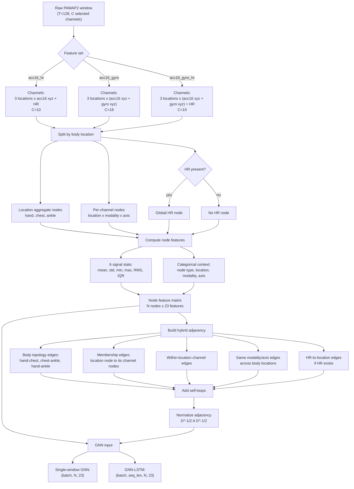
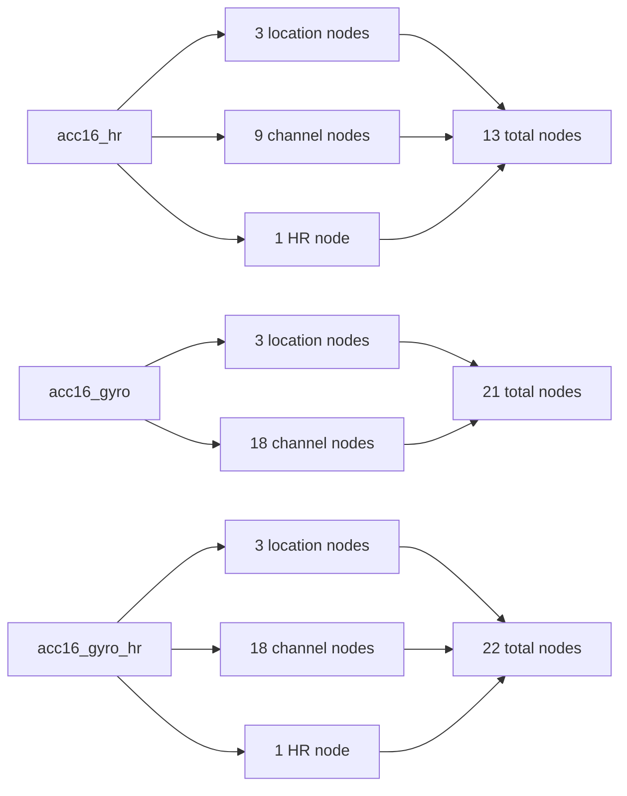
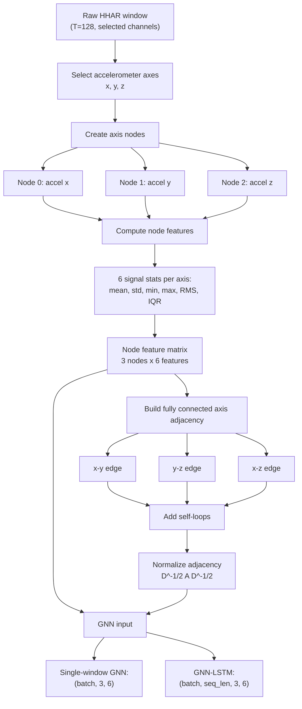
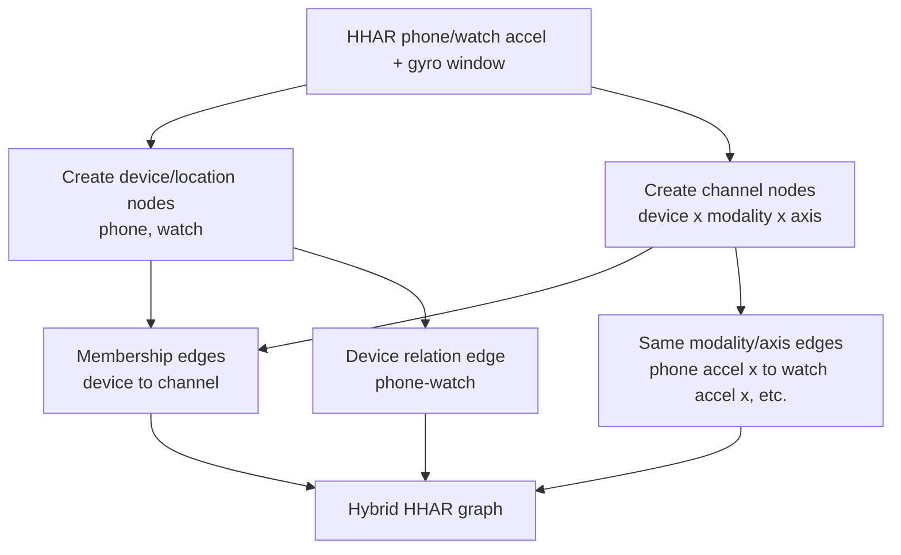

# Graph Generation Diagrams

These Mermaid diagrams describe the graph construction currently intended for
the canonical experiments.

## PAMAP2 Hybrid Graph Generation

### PAMAP2 Node Counts

## HHAR Graph Generation

The current HHAR graph is simpler because the processed HHAR path currently
uses accelerometer axes as graph nodes. If gyro is retained in a later canonical
HHAR feature path, this should be upgraded to the same hybrid location/channel
idea used for PAMAP2.

## Future HHAR Hybrid Option

